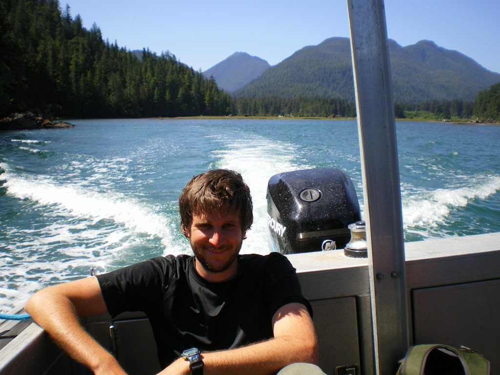

**Alex Koiter, M.Sc., Ph.D.**

I am excited to have recently joined (August 2017) the Department of Geography at Brandon University, MB as an assistant professor. In this role, I will be teaching a variety of undergraduate geography courses and continue my research in soil erosion, water quality and watershed processes.

I started my academic career as an undergraduate at the University of Guelph, ON, where a received (2006) a B.Sc. in environmental science. It was here that I first developed an interest in the relation between agriculture and the environment. From there, I moved to the prairies and perused a M.Sc. in soil science from the University of Manitoba, MB (2008) under the supervision of Dr. David Lobb. My Masters thesis looked at relation between agricultural soil and the atmosphere and my project specifically investigated and quantified the short-term carbon dioxide and nitrous oxide flux following the tillage of soil. After completing my Masters I moved to Vancouver Island (Nanaimo, BC) where a spent a year working for the Ministry of Forests and Range, Research Branch, as a research technician. This experience gave me the opportunity to work on a diverse range of projects and helped me develop some unique skills which included insect identification and measuring snow pack.

I then moved to Prince George, BC, where I completed my Ph.D. (2016) at the University of Northern British Columbia’s Natural Resources and Environmental Studies program working under the supervision of Drs. Phil Owens and Ellen Petticrew. My PhD dissertation focused on both refining the sediment fingerprinting technique and using it to identify the sources of sediment in a predominately agricultural watershed in south-central Manitoba. Sediment fingerprinting is a method by which natural properties of sediment (e.g., geochemical, radionuclide and colour tracers) are used as tracers to track sediment back to its sources.

## Professional and Research Associations

[Canadian Soil Science Society](http://www.csss.ca/) 2006 – Present  
[Soil Science Society of America](https://www.soils.org/) 2006 – Present  
[Soil and Water Conservation Society](http://www.swcs.org/) 2006 – Present  
[British Columbia Institute of Agrology](http://www.bcia.com/) 2008 – 2016  

