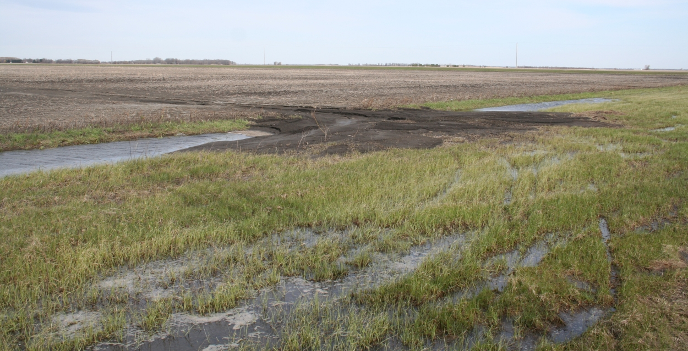

<!-- Removed the title yaml to get the picture to stay at the top -->

# Dr. Alex Koiter
#### Sediment on the move

Issues surrounding the impairment of soil and water quality are widespread and exist not only here in Canada, but it is also a problem facing many other countries. I believe that these are issues that need to be urgently addressed as every one’s well-being relies on access to clean water and healthy soils. As the global population continues to increase the pressures placed on our water and soil resources will also rise to meet the demand. The security and integrity of these resources and the ecosystem in which they exist are being threatened by human activity. It is imperative that all land and water be managed in a manner that does not compromise the environment or the people who live in it while still providing the water, food, fibre and fuel that is needed. This is not an easy task to accomplish and there is much discussion as to the best way to achieve our goals. I am glad to be part of the discussion.
