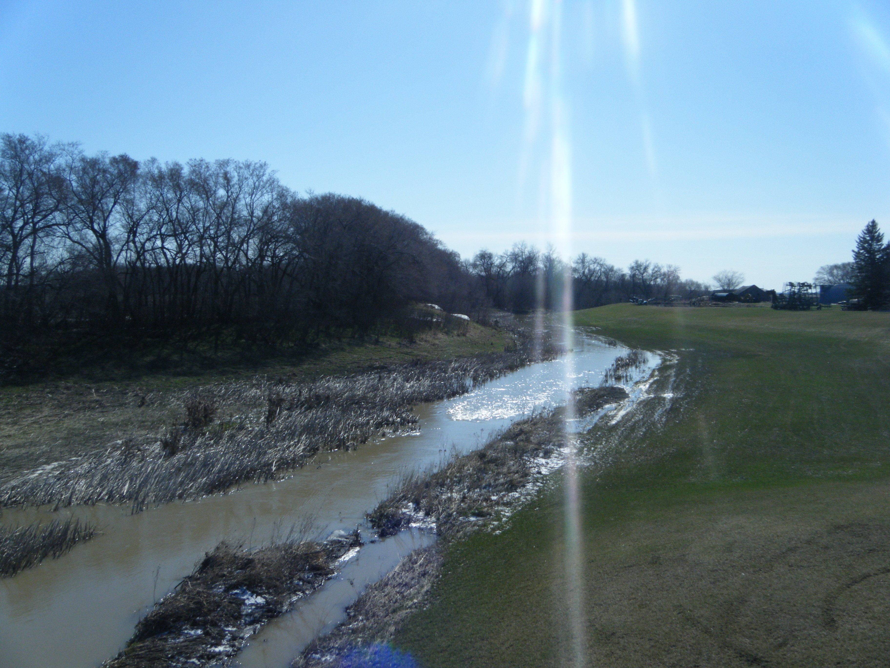
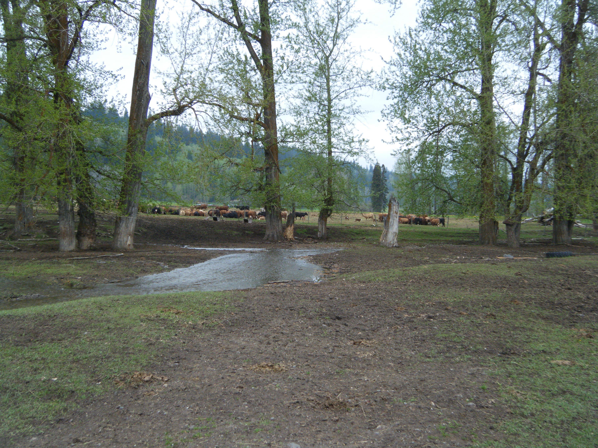
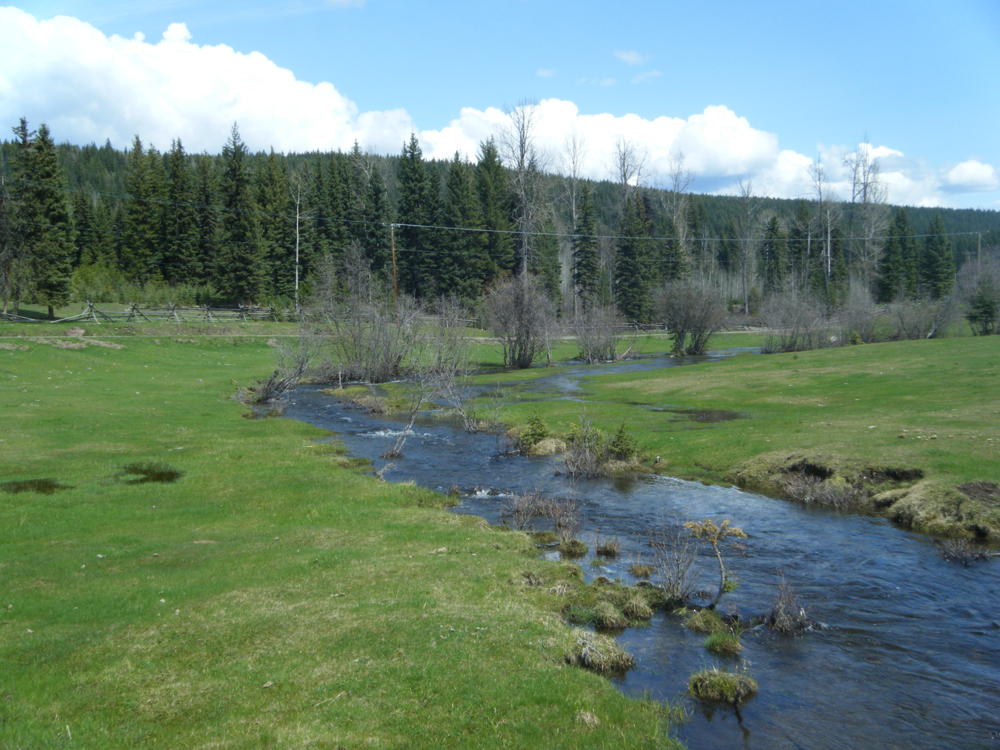

## Current Projects

My work, broadly speaking, focuses on the interaction between watershed management and geomorphology and how this affects both soil erosion and downstream water quality. My principal area of research concerns sediment fingerprinting. Sediment fingerprinting is a method by which natural properties of sediment are used as tracers to track sediment back to its sources. My work has focused on soil and sediment geochemical, radionuclide and colour tracers.

My primary research project involves collaborations between Agriculture and Agri-food Canada, University of Northern BC and the University of Manitoba. In this project I use sediment fingerprinting to assess the sources of sediment within watersheds from both management and geomorphic perspectives. The two watersheds that I am currently focusing on are the South Tobacco Creek watershed in south-central Manitoba and the Black Brook watershed in north-western New Brunswick. In this project I both assess sources of sediment and refine the sediment fingerprinting approach. In particular I am evaluating different types of tracers, refining sampling and modelling techniques, and assessing the benefit of including multiple lines of evidence. Besides these research-based items, I am also developing a methodological framework to move sediment fingerprinting from a research tool to a management tool for use by environmental consultants, watershed managers and community groups.

## Past Projects

It’s sedimentary, my Watson: Influence of watershed processes on the sediment fingerprinting approach (2010-2016). Doctoral Dissertation – University of Northern BC, Prince George, BC

Town Hall Meetings – Where Communities and Science Meet (2012). Participant – Quesnel River Research Centre, Likely, BC

Earth day celebrations in Quesnel, BC (2012). Participant – Quesnel River Research Centre, Likely, BC

Climate change, water and salmon: from research into policy. The Stakeholder Workshop Series (2011). Participant – Quesnel River Research Centre, Likely, BC

Composition and quality of urban street sediment in Prince George and its impact on air and water quality. (2010-2011) Co-author – University of Northern British Columbia, Prince George, BC

Marine-derived nutrient floc generation and retention times in gravel beds. (2010-2011) Research Technician – Quesnel River Research Centre, Likely, BC

Quantifying the relationships between soil phosphorus measures and phosphorus loss by runoff and leaching for Manitoba soils under field conditions (2009). Research Associate – University of Manitoba, Winnipeg, MB

Determining the effects of forest harvesting on streamflow during rain-on-snow events in the Russell Creek watershed (2008-2009). Research Technician – Ministry of Forests and Range, Nanaimo, BC

Coast Region Experimental Arthropod Project (CREAP), Roberts Creek Study Forest (2008-2009). Research Technician – Ministry of Forests and Range, Nanaimo, BC

Rapid analysis of moisture, carbon and nitrogen in peat cores from northern Manitoba by near-infrared spectroscopy (2008-2009). Research Technician – PDK Projects, Nanaimo, BC

Short-term carbon dioxide and nitrous oxide flux following tillage of the clay soil of the Red River Valley in Southern Manitoba (2006-2008). Masters Thesis – University of Manitoba, Winnipeg, MB

